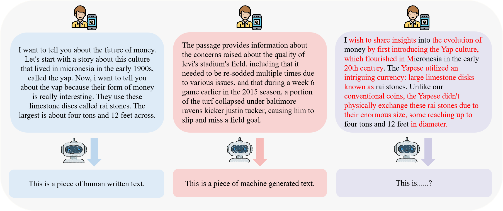
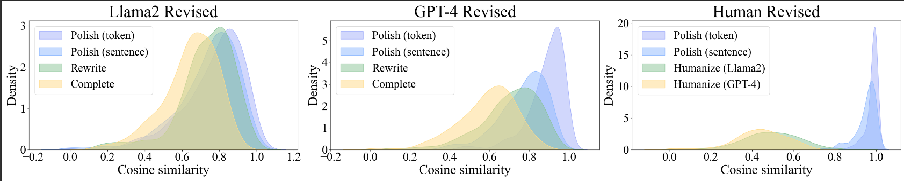

<div align="center">
<h1>Mixset</h1>



<p align="center">
<a href="https://arxiv.org/pdf/2311.06749" target='_blank'>[arXiv]</a>
</p>
This repository is a official code of the research presented in the paper ["Mixset"](https://arxiv.org/pdf/2311.06749). The goal is to provide a transparent, open-source implementation for the community to explore and build upon.
</div>


## Abstract
...

## Prerequisites

- Python = 3.9
- Other dependencies specified in `requirements.txt`

## Installation

To set up your environment to run the code, follow these steps:

1. **Clone the Repository:**

```shell
git clone https://github.com/Dongping-Chen/MixSet.git
cd MixSet
```

2. **Create and Activate a Virtual Environment (optional but recommended) and Install the Required Packages:**

```shell
conda create --name mixset python=3.9
conda activate mixset
pip install -r requirements.txt
```

3. **Download Datasets**
To download the MGT datasets, please refer to [this link](https://1drv.ms/u/s!AivM2GUMbPYyjkgx6us826N6_j2P?e=yriuqR), then move the dataset folders to `<YOUR PATH>/MixSet/data/MGT_datasets/`.
To download the HWT datasets, please refer to [this link](https://1drv.ms/u/s!AivM2GUMbPYyjkl-aRs1m_l5X9kW?e=xu2QjU), then move the dataset folders to `<YOUR PATH>/MixSet/data/pure_processed_HWT/`.

4. **Download Checkpoints of GPT-Sentinel**
Download the pretrained [GPT-Sentinel t5-small](https://1drv.ms/u/s!AivM2GUMbPYyjkqfT_3Ri-fpnifX?e=eqG1t7) and put to `<YOUR PATH>/MixSet/`.

## Dataset: MixSet

### Overview
The MixSet dataset is a comprehensive collection designed for advanced machine learning experiments. It's structured to support a variety of tasks including text classification, natural language understanding, and more.

### Location
The dataset is located in the `./data/MixSet/` directory relative to the project's root. Ensure that this path exists and contains the necessary data files before running any scripts that depend on the MixSet dataset.

### Structure
Describe in detailed in [readme](https://github.com/Dongping-Chen/MixSet/tree/main/data/MixSet).

### Usage
To use the MixSet dataset in your experiments, refer to the scripts or modules specifically designed to read and process this data. Ensure that any path or configuration settings in your scripts point to the correct `./data/MixSet/` location.

### Customization
If you customize or extend the dataset, consider documenting your changes here. This might include adding new files, filtering or processing data, or generating synthetic data points.

### Acknowledgements
If the MixSet dataset is sourced from or inspired by an external project, publication, or another dataset, be sure to acknowledge the original creators or contributors here.

### Contact
For any issues, questions, or suggestions related to the MixSet dataset, please contact [Dongping Chen](mailto:cdp_0612@163.com) or open an issue in the project's repository.

## Usage

1. **Experiment 1**
To reproduce the first experiments, run:
```shell
./Ex1_run.sh
```
You should run GPT-Zero by:
```shell
./Ex1_run_GPTzero
```
As for [Ghostbuster](https://github.com/vivek3141/ghostbuster), we will update the code as soon as possible.

2. **Experiment 2**
To reproduce the second experiments for binary classification, run:
```shell
./Ex2_binary_run
```
To reproduce the second experiments for three-class classification, run:
```shell
./Ex2_three_class_run
```
### Storage Requirements for Experiment 3 and 4 Scripts

Please be aware that the scripts for Experiment 3 and 4 require storing trained checkpoints in the folder path. This may occupy more than 20GB of space. It is essential to ensure that you have sufficient storage available on your device. Failing to allocate the necessary space might lead to interruptions during the code execution. We highly recommend checking and freeing up adequate space before running these scripts to ensure a smooth and uninterrupted experience.

3. **Experiment 3**
To reproduce the third experiments for operation-wise transfer learning, run:
```shell
./Ex3_operation_train.sh
./Ex3_operation_test.sh
```
To reproduce the third experiments for LLM-wise transfer learning, run:
```shell
./Ex3_LLM_transfer.sh
```

4. **Experiment 4**
To reproduce the fourth experiments for ablation study, run:
```shell
./Ex4_auto_train.sh
./Ex4_auto_test.sh
```
### Parameters

You can customize the execution by specifying various parameters on your self for free:

### Script Parameters Description

Below are the parameters used in the script along with their descriptions:

- `--Mixcase_filename`: Specifies the filename for the Mixcase data. Default is `None`.
- `--MGT_only_GPT`: If set, the script will only use MGT (Model Generated Text) from GPT-family models.
- `--test_only`: If set, the script will only perform testing, skipping any training procedures.
- `--train_threshold`: Specifies the threshold for training. Default is `10000`.
- `--no_auc`: If set, the script will only calculate the Mixcase scenarios, which means no Area Under the ROC Curve (AUC) metrics.
- `--only_supervised`: If set, the script will perform only supervised learning without any unsupervised techniques.
- `--train_with_mixcase`: If set, the script will include Mixcase data in the training process.
- `--seed`: Sets the seed for random number generation to ensure reproducibility. Default is `0`.
- `--ckpt_dir`: Specifies the directory to save checkpoints. Default is `"./ckpt"`.
- `--log_name`: Specifies the name of the log file. Default is `'Log'`.
- `--mixcase_threshold`: Sets the threshold for considering data as Mixcase. Default is `0.8`.
- `--transfer_filename`: Specifies the filename for transfer learning. Default is `None`.
- `--three_classes`: If set, the script will use a three-class classification scheme instead of binary classification.
- `--finetune`: If set, the script will fine-tune the supervised model.
- `--mixcase_as_mgt`: If set, Mixcase data will be treated as Model Generated Text (MGT).


## Contributing

Contributions to this project are welcome. Please consider the following ways to contribute:

- Reporting issues
- Improving documentation
- Proposing new features or improvements

## Acknowledgements

This project is based on the findings and methodologies presented in the paper [MixSet](https://arxiv.org/pdf/2311.06749). Part of the code is borrowed from [MGTBench](https://github.com/xinleihe/MGTBench).

## Citation

```

```